<div align=center></div>

# TMom

#### 介绍
支持多厂区/多项目级的MOM/MES系统，计划排程、工艺路线设计、在线低代码报表、大屏看板、移动端、AOT客户端......
目标是尽可能打造一款通用的生产制造系统。前端基于最新的vue3、ts、ant design vue, 后端使用.net8、Sqlsugar，支持多种数据库切换、数据隔离与聚合

- 账号：test，密码：123456
- [在线预览](https://www.yefeng.club/)
- [说明文档](https://yefeng.club/tmomdoc/)
  
#### 安装

- 安装依赖

```bash
cd ./web

pnpm i

```

- 运行

```bash
pnpm dev
```

- 打包

```bash
pnpm build
```

#### 系统架构

#### 说明

1. 前端基于vue3-antdv-admin开发!
2. 后端基于.net8、Sqlsugar DDD架构，支持多种数据库
3. 基础代码前后端CRUD+数据库表直接使用代码生成
4. 报表查询在线配置Sql/Api方式查询数据，支持多种数据源: sqlserver、mysql、pgSql等等
5. 大屏基于goview修改，增加了部分组件
6. 移动端使用uniapp开发，暗黑模式、在线升级等等，主要用于车间操作，如设备点检、保养、报修维修等
7. 在线模板功能设计，根据不同行业不同需求，设计符合业务需求的操作模板界面
8. 支持多厂区/多项目级，支持数据隔离与聚合报表数据查询，非常适合集团性、多元化企业
9. 可视化工艺流程、工艺文件管理、工单排程
10. 多系统集成, 如: SAP、钉钉、WMS、QMS、金蝶、用友等
11. **部分功能待完善**

### TODO

- [ √ ] 质量管理
- [ √ ] APP管理
- [ √ ] 数据采集
- [   ] 仓库管理
- [   ] 消息管理
- [   ] 产品追溯
- [   ] 设备OEE

#### 项目截图

- 工艺流程设计


- 工单排程
  
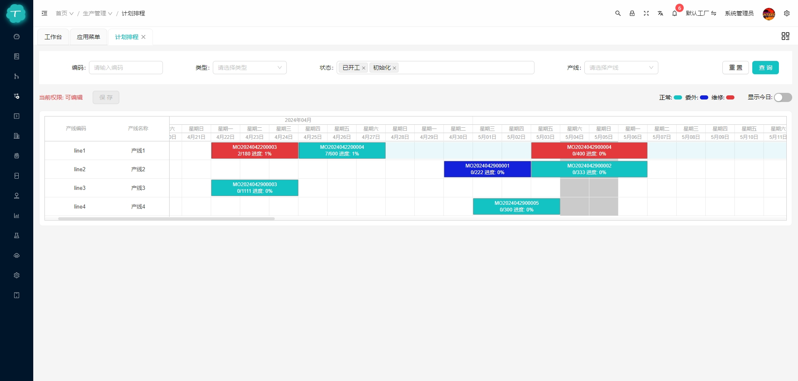

- 模板设计
  
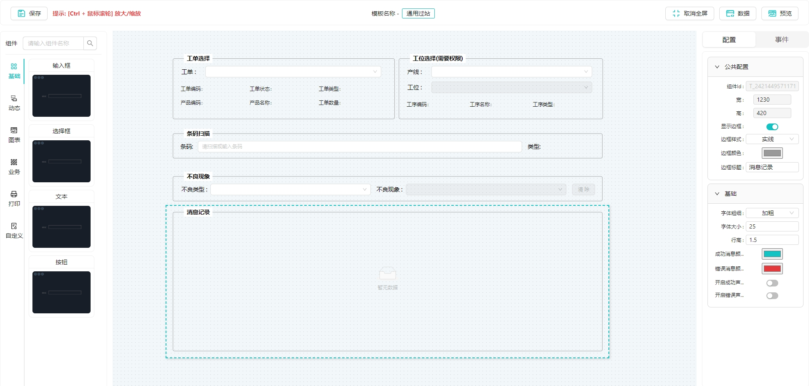

- 报表查询
  
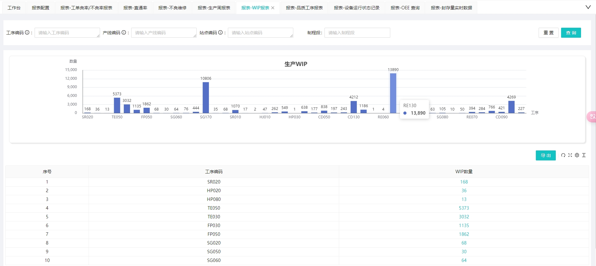

- 终端作业
  
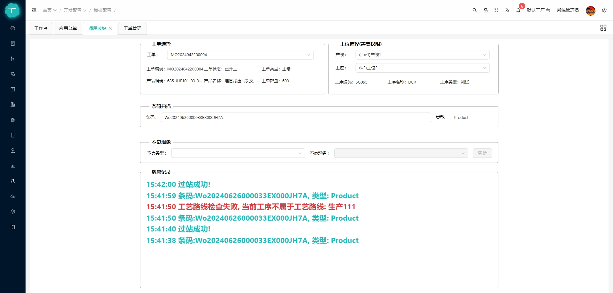

- 终端作业(客户端)
  
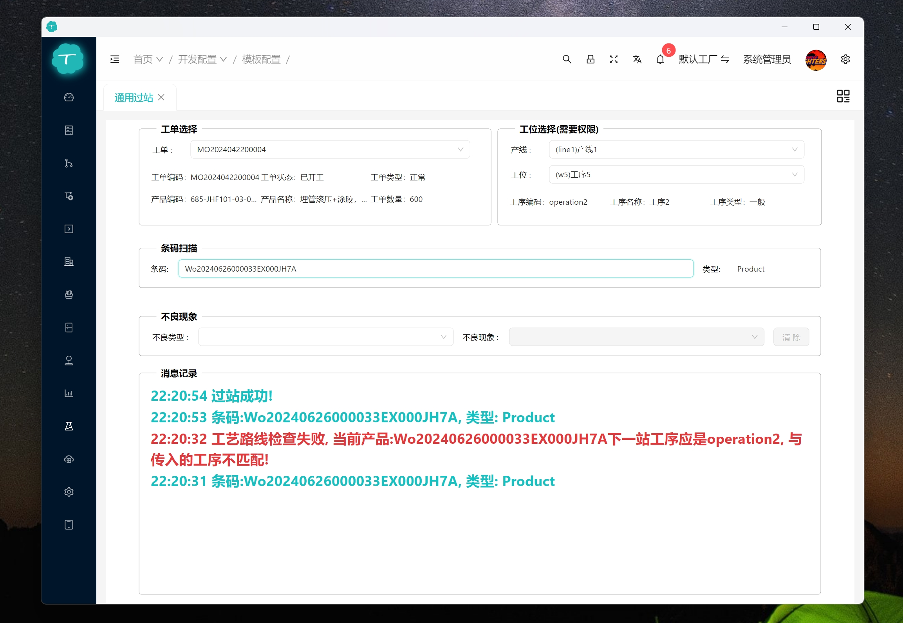

- 编码规则
  
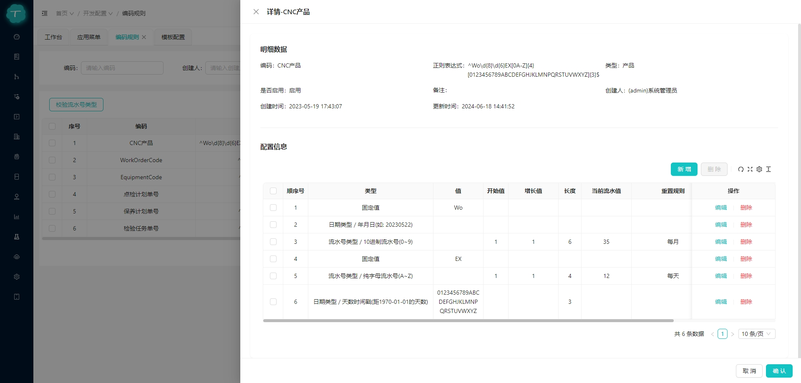

- 打印模板
  
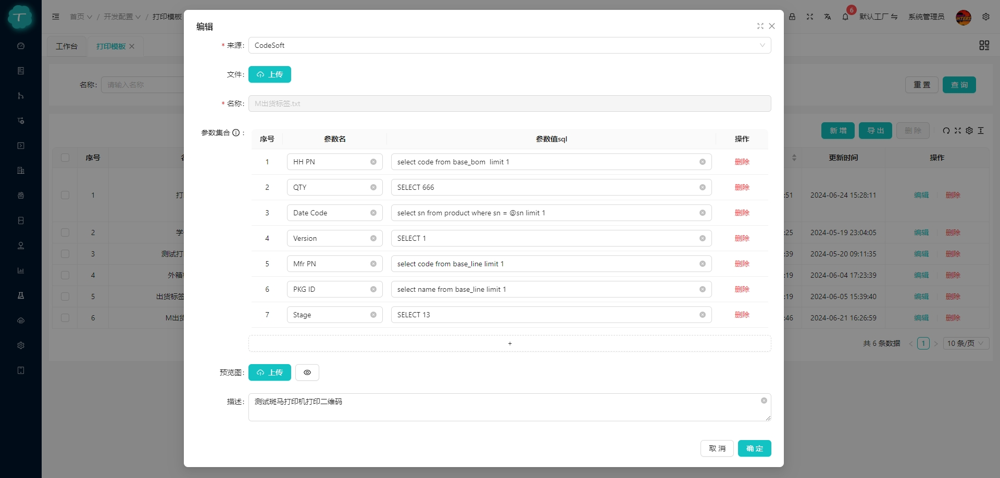

- 对象存储
  
<div align=center>
   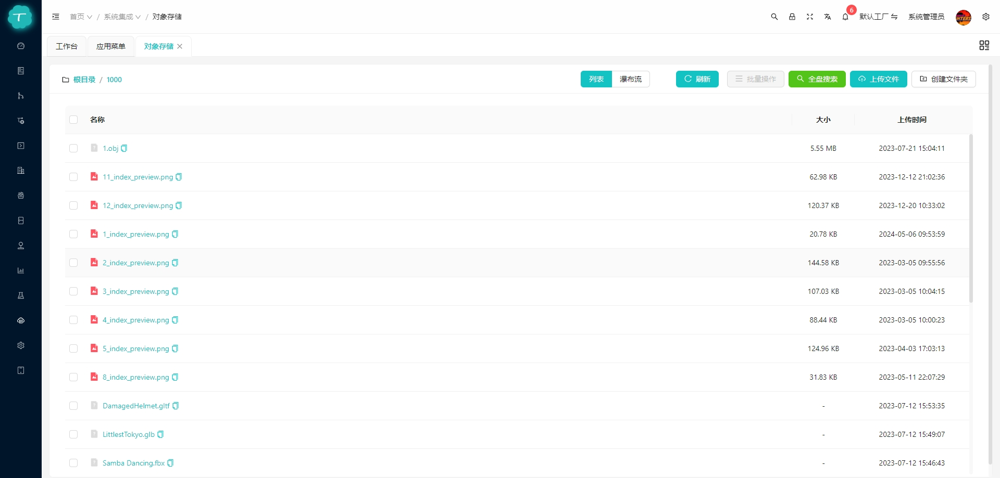
   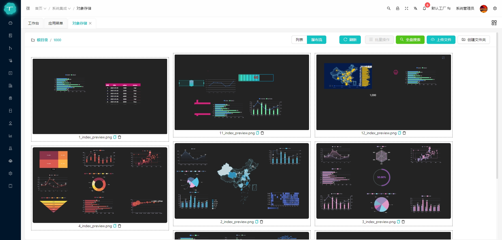
</div>

- APP
  
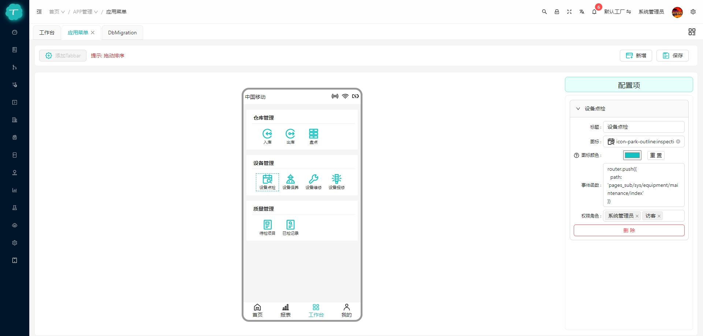
  
<div align=center>
   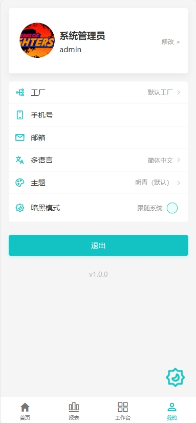
   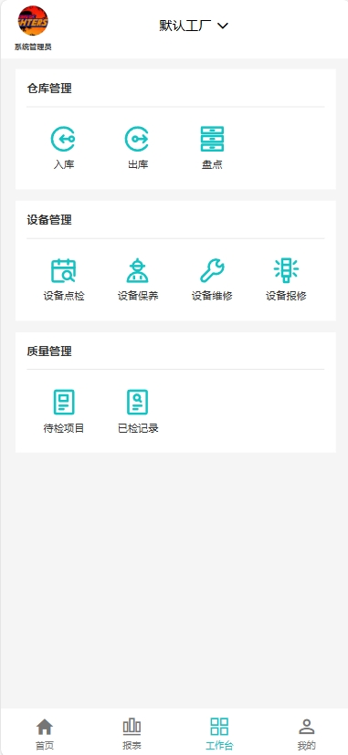
   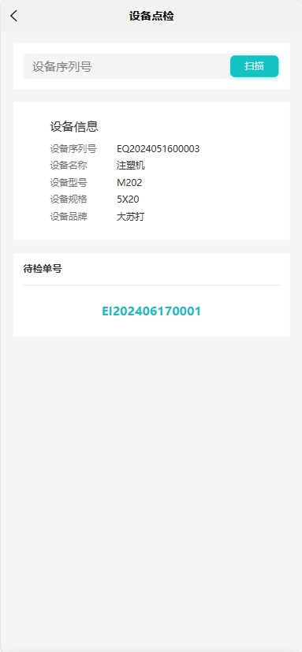
</div>