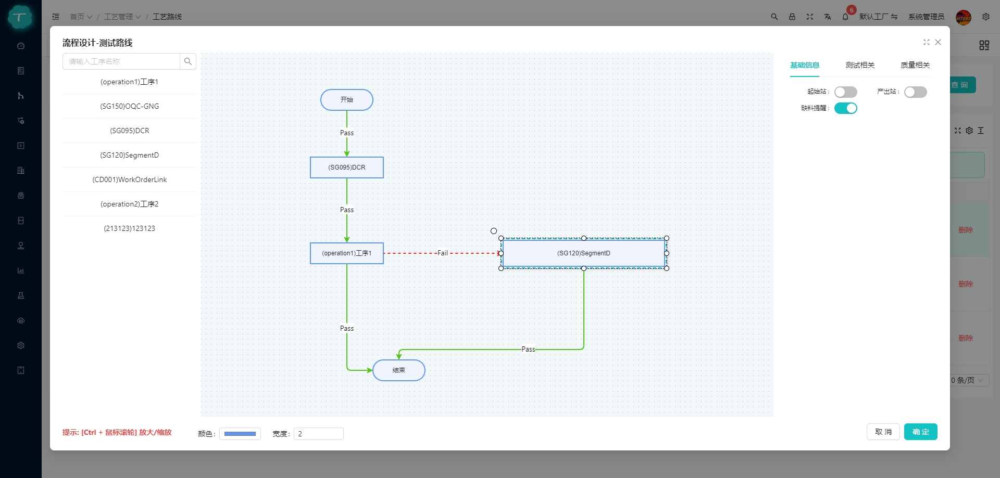

# TMom

#### 介绍
支持多厂区/多项目级的MOM/MES系统，计划排程、工艺路线设计、在线低代码报表、大屏看板、移动端、AOT客户端......
目标是尽可能打造一款通用的生产制造系统(虽然很难,，行业种类太多，定制化需求也很多)。前端基于最新的vue3、ts、antdesignvue, 后端使用.net8、Sqlsugar，支持多种数据库切换、数据隔离与聚合

- 账号：admin，密码：123456
- [在线预览](https://www.yefeng.club/)
  
#### 安装

-- 安装依赖

```bash
pnpm install

```

- 运行

```bash
pnpm dev
```

- 打包

```bash
pnpm build
```


#### 说明

1. 前端基于[vue3-antdv-admin](https://github.com/buqiyuan/vue3-antdv-admin)开发，感谢大佬开源的项目!
2. 后端基于.net8、Sqlsugar DDD架构，支持多种数据库
3. 基础代码前后端CRUD+数据库表直接使用代码生成
4. 报表查询在线配置Sql/Api方式查询数据，支持多种数据源: sqlserver、mysql、pgSql等等
5. 大屏基于goview修改，增加了部分组件
6. 移动端使用uniapp开发，暗黑模式、字体调整、在线升级等等，主要用于车间操作，如设备点检、保养、报修维修等
7. 在线模板功能设计，根据不同行业不同需求，设计符合业务需求的操作模板界面
8. 支持多厂区/多项目级，支持数据隔离与聚合报表数据查询，非常适合集团性企业生产制造
9. 可视化工艺流程、工艺文件管理、工单排程

#### 项目截图

- 工艺流程设计



- 工单排程
  


- 模板设计
  
